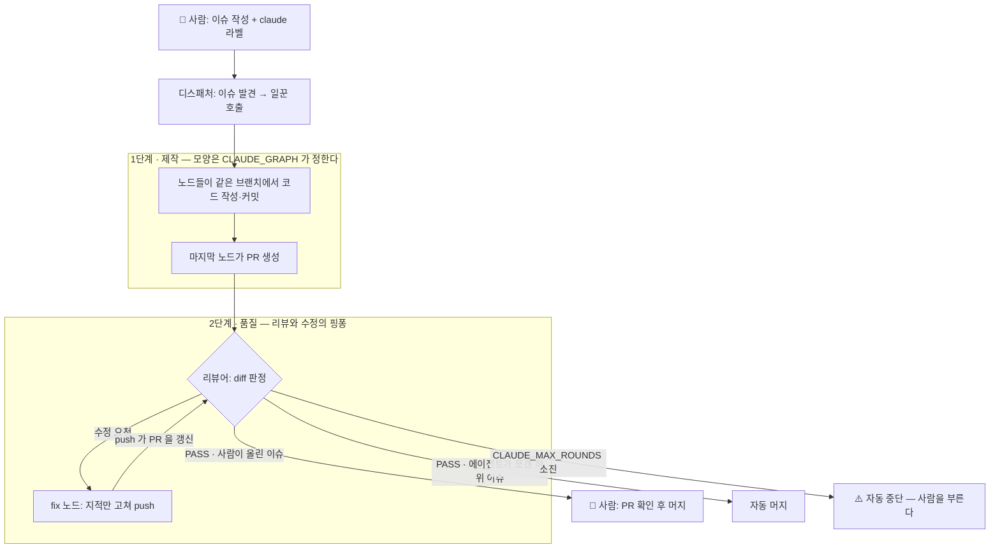
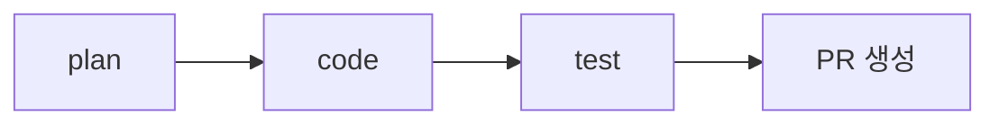
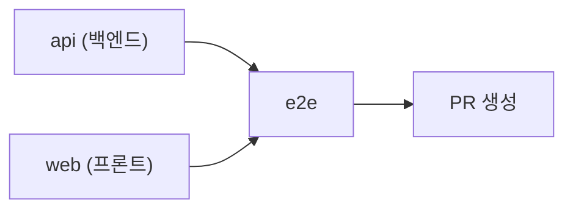
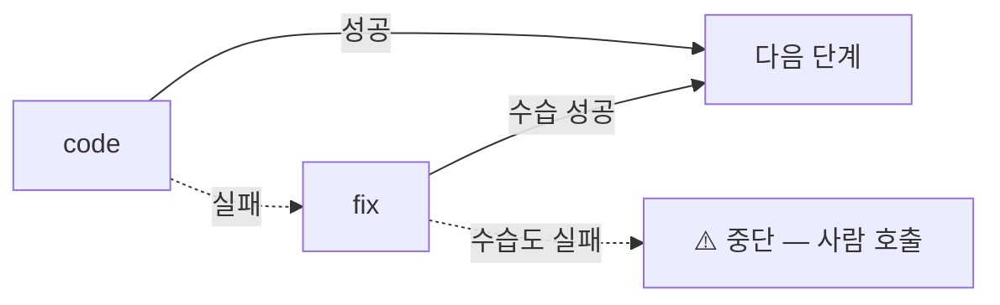
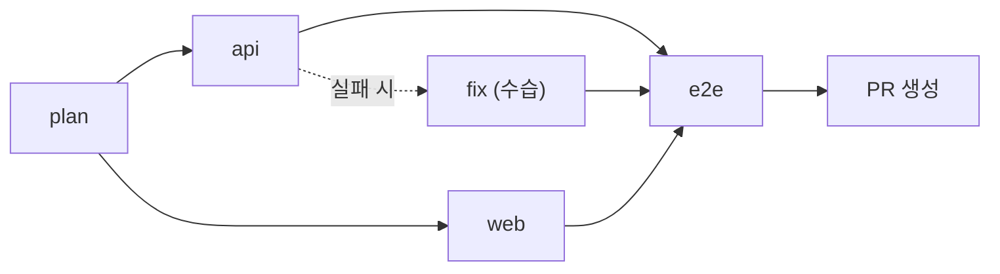
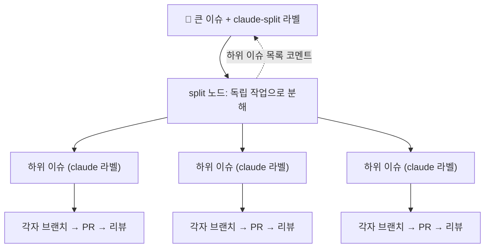

# 에이전트 동작과 설정

> **이 문서는 사람이 읽습니다.**

켜는 방법은 [setup.md](setup.md), 이슈 쓰는 법은 [issue-guide.md](issue-guide.md) 를 본다. 이 문서는 그 아래에서 무엇이 어떻게 도는지를 다룬다.

**기본값으로 그냥 써도 된다.** 이 문서는 "노드를 더 넣고 싶다", "리뷰 기준을 바꾸고 싶다" 처럼 동작을 손보고 싶어질 때 여는 것이다.

## 부품 세 개

[README 의 용어 표](../README.md#먼저-알아둘-말-여섯-개)에서 요약한 셋을, 여기서는 실제로 무엇을 하는지까지 펼친다.

| 부품 | 언제 도나 | 하는 일 |
|---|---|---|
| 디스패처 | 10분마다 | `claude`·`claude-split` 라벨 이슈를 찾아 일꾼을 부르고, 에이전트가 만든 것을 청소한다 (분할 상위엔 완료 보고 게시, 머지된 이슈 닫기, 이슈가 닫힌 PR 닫기, 머지된 `claude/*` 브랜치 삭제) |
| 일꾼 | 호출받을 때 | 브랜치를 만들어 코드를 쓰고 커밋·push, PR 을 연다 |
| 리뷰어 | PR 이 열리거나 갱신될 때 | diff 를 판정하고, 에이전트가 쪼갠 하위 이슈(`claude-made`)의 PR 은 통과 시 직접 머지한다 |

## 큰 그림 — 이슈 하나의 여정

**제작**(그래프)과 **품질**(리뷰 루프)의 2단계다. 사람이 손대는 곳은 맨 앞(이슈 작성)과 맨 뒤(머지)뿐이다.

새 기능은 맨 앞이 **스펙 작성 → 이슈 작성**의 두 단계다. 아래 그림은 그대로다 — 스펙은 CI 밖에서 만들어지고, 노드가 하는 일은 바뀌지 않는다 ([아래 절](#스펙-먼저-쓰기는-ci-밖에서-돈다)).



- 리뷰어는 판정만 하고 코드를 고치지 않는다. fix 노드는 고치기만 하고 판정하지 않는다.

- 리뷰 라운드가 `CLAUDE_MAX_ROUNDS`(기본 3회)를 넘기면 자동을 멈추고 사람을 부른다.

- 디스패처는 착수한 이슈에 `claude-sent` 라벨을 붙여 중복 착수를 막고, 일꾼은 `claude/issue-N` 브랜치에서 작업한 뒤 결과를 이슈에 회신한다.

## 규칙은 파일 경로가 고른다

규칙 스킬은 세 모듈로 나뉜다 — 공통은 `.claude/skills/`, 백엔드는 `backend/.claude/skills/`, 프론트엔드는 `frontend/.claude/skills/`.

일꾼과 리뷰어가 자동으로 읽으며, 어떤 규칙이 적용될지는 고치는 파일의 위치가 정한다.

    backend/api/... 또는 backend/core/core-<도메인>/... 를 고치면  → 백엔드 계층 규칙 (kotlin-*)
    frontend/src/... 를 고치면           → 프론트엔드 규칙 (frontend-react)

리뷰어가 머지를 막는 것은 두 가지뿐이다 — [코드 리뷰 규칙](../common/docs/code-review/rules.md)의 MUST 위반과 해당 영역 스킬의 Critical 항목. 스타일 취향이나 있으면 좋을 개선은 통과시키고 코멘트로만 남긴다.

## 여러 단계로 나눠 시키기 (`CLAUDE_GRAPH`)

`CLAUDE_GRAPH` 로 노드들을 잇는다. 기호는 세 개뿐이다. 노드는 **같은 브랜치**를 이어받으므로 앞 노드가 만든 파일과 커밋을 그대로 보고 작업한다.

| 문법 | 뜻 | 예 |
|---|---|---|
| `a>b` | 순차 — b 는 a 가 끝난 뒤 시작 | `plan>code>test` |
| `a+b` | 병렬 — 같은 단계에서 동시에. 다음 단계는 둘 다 끝나야 시작 | `api+web>e2e` |
| `a?b` | 수습 — a 가 실패하면 b 노드가 같은 브랜치를 이어받아 완수 | `code?fix>test` |

**`>` 순차** — `plan>code>test`



**`+` 병렬** — `api+web>e2e` (api 와 web 이 동시에, e2e 는 둘 다 끝난 뒤)



**`?` 수습** — `code?fix` (fix 는 code 가 실패했을 때만 일한다)



세 기호는 자유롭게 섞인다 — `plan>api?fix+web>e2e`:



Actions 탭에서 단계별 진행이 위 그림과 같은 모양으로 보인다.

- PR 은 마지막 노드가 만든다. 중간에 열면 완성 전 코드가 리뷰되기 때문이다.

- 수습(`?`)이 없는 노드가 실패하면 거기서 멈추고 이슈에 알린다. 수습 노드마저 실패해도 멈춘다.

- 병렬 노드는 같은 브랜치에 push 하므로 `api+web` 처럼 서로 다른 영역을 만지게 구성한다 (동시에 push 하면 rebase 후 재시도한다).

- **순차 단계(`>`)는 최대 4개다.** GitHub Actions 는 잡을 실행 중에 만들어 낼 수 없어서 단계 잡을 미리 선언해 두기 때문이다. 병렬(`+`)로 묶는 수에는 제한이 없다. 더 필요하면 작업을 두 번에 나눠 지시한다.

## 큰 이슈는 쪼개서 시키기 (`claude-split`)

이슈에 `claude` 대신 **`claude-split`** 라벨을 붙이면, 분할 노드가 이슈를 각각 혼자 머지될 수 있는 하위 이슈 2~6개로 쪼갠다.

하위 이슈에는 `claude` 라벨이 붙어 있어 디스패처가 하나씩 착수한다 — 그 뒤는 보통 이슈와 같은 흐름이다.



- 하위 이슈들은 **병렬**로 진행된다 (각자 브랜치·PR). 순서가 얽힌 일은 분할 노드가 한 이슈로 묶는다. 백엔드와 프론트를 함께 바꿔야 하는 기능도 한 이슈로 묶인다 — API 계약이 먼저 정해져야 화면을 만들 수 있어서다.

- 분할 노드는 코드를 만지지 않고, 만든 하위 이슈 목록을 상위 이슈에 코멘트로 회신한다.

- 상위 이슈 본문에 **하위 이슈 체크리스트**가 생긴다. 하위 이슈가 닫힐 때마다 디스패처가 체크하고, **전부 끝나면 하위 작업별 결과 보고(커밋·변경 파일)를 상위 이슈에 단다.**

  상위 이슈 마감은 사람이 보고를 확인하고 직접 한다 — 사람이 만든 것은 사람이 끝낸다.

- 상위 이슈에는 `claude-sent` 가 붙어 다시 분할되지 않는다. 떼면 재분할된다.

### 풀스택 그래프 (`api>web>e2e`)

새 기능을 처음부터 끝까지 만들 때 쓴다.

| 노드 | 하는 일 |
|---|---|
| `api` | 백엔드 API 구현. 만든 엔드포인트를 `CONTRACT.md` 에 기록 |
| `web` | `CONTRACT.md` 와 백엔드 코드를 읽고 프론트 화면 구현 |
| `e2e` | E2E 테스트 작성·실행 후 PR 생성 |

`web` 노드는 필드 이름과 타입을 추측하지 않고 백엔드 코드에서 확인한다. `api+web` 로 병렬화하지 않는 이유도 같다 — 계약이 먼저 있어야 한다.

## 처음 프로젝트 세우기 (초기 구축)

프로젝트를 처음 만들 때는 이슈 대신 [TASK.md](../TASK.md) 명세로 시작한다.

**1. 사람이 먼저 해 둘 것** — 에이전트가 대신 못 하는 세 가지.

- 에이전트 켜기: [setup.md](setup.md)

- 백엔드 뼈대: [backend/README.md](../backend/README.md)

- 프론트 설정: 없음 — 주소·키는 `frontend/app.json` 의 `extra` 에 있다

**2. TASK.md 를 채운다** — 양식이다. 각 절의 `>` 안내를 보고 빈자리를 채우면 된다. 필수는 네 절(개요·도메인·기능·완료 기준)이고, 아래쪽 (선택) 절은 쓰지 않으면 통째로 지운다. 채우고 커밋한다.

**3. 호출한다** — 모든 노드가 같은 명세를 받는다.

```bash
gh workflow run claude-agent.yml -f prompt="@TASK.md" -f graph="api>web>e2e"
```

api 노드는 시작 전에 전제(백엔드 뼈대)를 확인하고, 없으면 구현하지 않고 보고 후 중단한다. 초기 구축 PR 이 머지되면 이후 작업은 이슈 + `claude` 라벨로 진행한다.

**작은 작업은** 파일 없이 짧은 문자열을 `prompt` 로 바로 넘겨도 된다. 명세가 여럿이 되면 `docs/tasks/<이름>.md` 로 늘리고 `@docs/tasks/<이름>.md` 로 가리킨다.

## 기능별 파일

에이전트 동작은 기능마다 파일 하나다. 고칠 기능의 파일만 열면 된다.

| 기능 | 파일 |
|---|---|
| 이슈 감지·무인 정리 | `.github/workflows/claude-dispatch.yml` |
| 그래프 실행 (진입점) | `.github/workflows/claude-agent.yml` |
| 코드 작성 (노드 본체) | `.github/workflows/claude-node.yml` |
| 그래프 펼치기 (`>`·`+`·`?`) | `.github/agent/graph.js` |
| 코드 리뷰·자동 머지 | `.github/workflows/claude-review.yml` |
| 노드 역할 정의 | `.github/agent/nodes/<이름>.md` |
| 공통 스위치 | `.github/agent/settings.env` |
| 배포 | `.github/workflows/deploy.yml` ([deploy.md](deploy.md)) |
| 스펙 먼저 쓰기 | `.github/agent/setup-speckit.sh` ([sdd-guide.md](sdd-guide.md)) — CI 밖에서 돈다 |

전체 지도는 [.github/README.md](../.github/README.md).

## 설정 바꾸기

스위치는 [.github/agent/settings.env](../.github/agent/settings.env) 에, 노드 지시문은 [.github/agent/nodes/](../.github/agent/nodes/) 에 있다. 기본값으로 두어도 된다.

| 변수 | 기본값 | 바꾸면 |
|---|---|---|
| `CLAUDE_GRAPH` | `code` | 노드 구성 (`>` 순차 · `+` 병렬 · `?` 수습) |
| `CLAUDE_MAX_ROUNDS` | `3` | 재수정 횟수 |
| `CLAUDE_RUNNER` | `ubuntu-latest` | 잡이 도는 러너 (self-hosted 등) |
| `CLAUDE_JAVA_VERSION` · `CLAUDE_NODE_VERSION` | `25` · `22` | 런타임 버전 |
| `CLAUDE_REVIEW_BAR` | — | 머지를 막는 기준 |
| `CLAUDE_DIFF_LIMIT_BYTES` | `100000` | 리뷰가 한 번에 읽는 diff 상한 |

노드를 새로 만들려면 `.github/agent/nodes/<이름>.md` 를 추가하고 `CLAUDE_GRAPH` 에 이름을 잇는다.

**설정은 항상 기본 브랜치의 것이 쓰인다.** 작업 브랜치에서 고쳐도 그 작업에는 반영되지 않는다.

스펙 먼저 쓰기 쪽에도 사람이 관리하는 설정이 하나 있다 — `common/speckit-ko/speckit-version.txt` 가 이 프로젝트의 spec-kit 버전을 고정한다. 노드는 이 값을 읽지 않는다.

## 어디까지 자동인가

| | 상태 |
|---|---|
| 이슈 감지·착수 | 자동 |
| 코드 작성·커밋·PR 생성 | 자동 |
| 코드 리뷰·판정 | 자동 |
| 지적 사항 수정 (최대 3회) | 자동 |
| 머지 후 이슈 닫기·브랜치 삭제 | 자동 |
| 백엔드 유닛 테스트·ktlint | 자동 |
| 프론트엔드 타입 검사·빌드 | 자동 |
| E2E 테스트 실행 | 백엔드를 띄울 수 있어야 함. 못 띄우면 코드만 남기고 그 사실을 보고한다 |
| PR 머지 | 사람이 올린 이슈는 **사람**, 에이전트가 쪼갠 하위 이슈는 자동 (충돌 시 사람) |
| 스펙 작성 (새 기능) | **사람** — 아래 참고 |

## 스펙 먼저 쓰기는 CI 밖에서 돈다

스펙 먼저 쓰기([sdd-guide.md](sdd-guide.md))를 써도 **노드는 그 도구를 쓰지 않는다.**

노드가 Claude 에게 허용하는 명령이 `git`·`gradle`·`npm` 으로 좁혀져 있기 때문이다(`.github/agent/run-claude.sh` 의 `ALLOWED`).

이슈·PR 같은 API 호출은 셸이 하고 Claude 에게 토큰을 주지 않으려고 일부러 좁힌 것이라, `/speckit-*` 를 돌리려고 넓히지 않는다.

그래서 역할이 이렇게 갈린다.

    💻 로컬(사람)  /speckit-* 로 스펙을 만들어 specs/ 에 커밋
    🌐 CI(노드)    커밋된 specs/ 를 읽어 구현

이슈 본문에 스펙 경로(`specs/003-주문취소/spec.md`)를 적으면 노드가 그 문서를 읽는다. 노드 쪽 설정은 바꿀 것이 없다.
