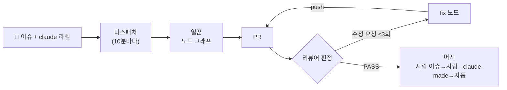
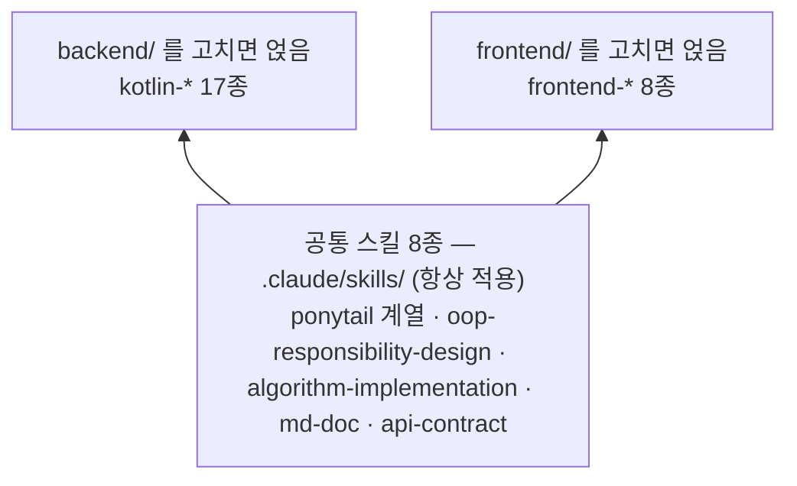
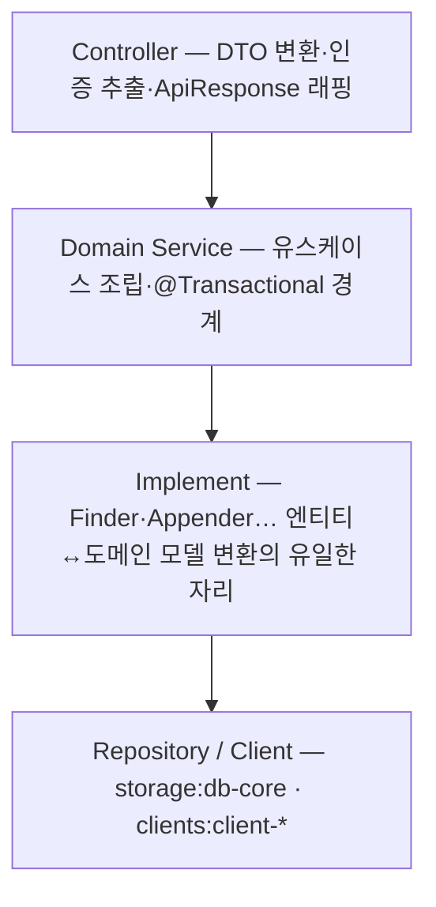

# 아키텍처 개요

> **이 문서는 사람이 읽습니다.** 저장소 전체 구조를 한 장으로 보여주는 개요이며, **규칙의 원문은 각 절이 가리키는 문서가 기준이다.**
> 웹 버전(다이어그램 포함)은 Claude 아티팩트로도 있다 — 세션 참여자는 `/artifacts` 로 연다.

**만들 것을 글로 적어 두면, Claude 가 코드를 짜고 스스로 리뷰까지 마친 PR 을 여는 저장소 템플릿**이다.

사람이 하는 일은 둘뿐이다 — 무엇을 만들지 쓰기, 완성된 PR 을 머지할지 결정하기.

## 저장소를 이루는 네 덩이

| 덩이 | 위치 | 내용 |
|---|---|---|
| 자동화 본체 | `.github/` | 이슈 발견 → 코드 작성 → PR → 리뷰 → 자기 수정 → 배포까지 도는 워크플로 5개 |
| 코딩 규칙 스킬 | `*/.claude/skills/` | 33종 — 공통 8 · 백엔드 17 · 프론트 8 |
| 스펙 먼저 쓰기 (SDD) | `.specify/` · `specs/` | 새 기능은 스펙을 먼저 쓰고 그것을 기준으로 구현한다. 스펙과 코드가 어긋나면 코드를 고친다 |
| 앱 뼈대 | `backend/` · `frontend/` | 프론트는 완성 동봉(Expo — iOS·Android·웹 한 코드), 백엔드는 사람이 한 번 채우는 빈 자리 |

권한 경계 — **Claude 는 파일만 쓴다.** 이슈·PR·라벨 같은 API 호출은 셸이 하고, 허용 명령도 `git`·`gradle`·`npm` 으로 좁혀져 있다.

## 자동화 파이프라인 — 이슈 하나의 여정

리뷰어는 판정만 하고 코드를 고치지 않는다. fix 노드는 고치기만 하고 판정하지 않는다. 라운드를 소진하면 자동을 멈추고 사람을 부른다.

그래프 문법(`>` 순차 · `+` 병렬 · `?` 수습), 노드 8종의 역할, 분할(`claude-split`) 흐름의 상세는 [agent-guide.md](agent-guide.md) 에 있다.

## 규칙(스킬) 체계 — 3계층

**공통 스킬은 고치는 파일의 위치와 무관하게 항상 깔리고, 위치가 그 위에 얹는 영역 스킬을 고른다.**

| 모듈 | 색인 | 구조 |
|---|---|---|
| 공통 8종 | [.claude/skills/README.md](../.claude/skills/README.md) | 스택 무관 — YAGNI(ponytail), 책임 설계, 알고리즘, 문서, 서버-클라이언트 계약(api-contract) |
| 백엔드 17종 | [backend/.claude/skills/README.md](../backend/.claude/skills/README.md) | 항상 셋(common·module-layout·test) + 만드는 순서 7 + 상황별 7 |
| 프론트 8종 | [frontend/.claude/skills/README.md](../frontend/.claude/skills/README.md) | 항상 둘(common·style) + 계층별 4(api·service·hooks·screen) + lib·e2e |

스킬은 전부 같은 모양이다 — 규칙 → 적발 신호(**Critical** 은 머지 차단, Important 는 참고 코멘트) → 체크리스트.

리뷰어가 머지를 막는 것은 둘뿐이다: [rules.md](../common/docs/code-review/rules.md) 의 MUST 위반과 스킬의 Critical 항목.
리뷰어 자체는 `common/harness-tests/` 의 심어 둔 위반 케이스로 회귀 검증한다.

스타일·계약 스킬 3종(`kotlin-style`·`api-contract`·`frontend-*`)이 공유하는 목표(유지보수성·정합성·가독성)와
필드 추가·개명 시 최소 수정 경로는 [api-contract](../.claude/skills/api-contract/SKILL.md) 에 있다.

## 백엔드 아키텍처

Gradle 멀티모듈이라 참조 방향이 빌드로 강제된다. 상세와 배치표는 `backend/.claude/skills/kotlin-module-layout`, 뼈대 만들기는 [backend/README.md](../backend/README.md).

**엔티티 차단선** — 엔티티는 Implement 위로 올라가지 않는다. 그 위로는 도메인 모델(`Result`)만 오른다.
DB 사정이 업무 코드로 번지지 않게 하기 위해서고, 컬럼을 바꿔도 도메인 모델이 그대로면 위쪽 코드는 아무것도 모른다.

## 프론트엔드 아키텍처

도메인이 최상위 폴더고 그 아래가 계층이다. 참조는 `screens → hooks → services → api → lib` 한 방향.

핵심은 **페이지 무상태** — 화면은 훅 1개를 부르고 JSX 만 반환하며, 상태코드 분기는 services 에만 있다.
규칙을 그대로 구현한 정답 코드가 `frontend/src/user/` 에 살아 있다 — 새 화면은 그것을 복사해 시작한다.

## 문서 구조 — 독자가 위치를 정한다

| 독자 | 문서 |
|---|---|
| 📖 사람 | [README.md](../README.md) 진입점 · [docs/](README.md) 설명서(읽는 순서 번호) · 모듈별 README · [.github/README.md](../.github/README.md) CI 지도 |
| 🤖 에이전트 | `CLAUDE.md`·`AGENTS.md` 진입점 · 스킬 3계층 · `common/docs/`(리뷰 규칙·자동화 명세) · 헌법(규칙 사본이 아닌 포인터 — 스킬이 이긴다) |
| ↔️ 경계 (이동 금지) | `TASK.md` 사람→에이전트 주문서 · `CONTRACT.md` api 노드→web 노드 API 계약 |

사람이 고치는 설정은 셋이다 — `.github/agent/settings.env`(그래프·리뷰 기준), `.github/agent/nodes/*.md`(노드 지시문),
`common/docs/code-review/rules.md`(팀 리뷰 규칙).

규칙을 고칠 때는 그 규칙을 말하는 문서를 전부 찾아 고치고 재검색해 0건을 확인한다 — 절차는 헌법 원칙 VI.

## 현재 상태 (2026-08-25 기준)

| 영역 | 상태 |
|---|---|
| 자동화 워크플로 5 · 규칙 스킬 33종 | 완성 |
| 프론트엔드 | 완성 — 도메인 4개(user·splash·map·ads), `src/user/` 가 본보기 |
| 백엔드 | 빈 자리 — [backend/README.md](../backend/README.md) 1~5절대로 사람이 뼈대를 한 번 채운다 |
| `CONTRACT.md` · `TASK.md` | 비어 있음 — 첫 구축 지시 전 |
