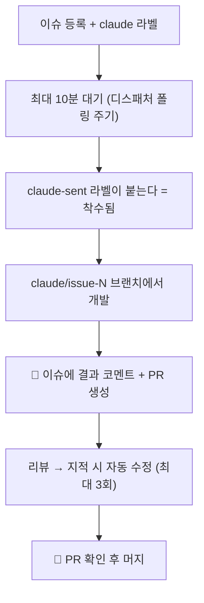
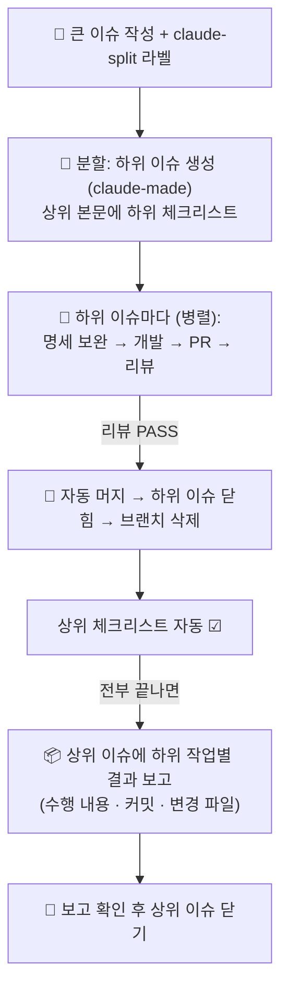

# 이슈로 작업 시키기

> **이 문서는 사람이 읽습니다.**

전제: [setup.md](setup.md) 까지 끝난 상태. 동작 원리는 [agent-guide.md](agent-guide.md).

에이전트에게 일을 시키는 방법은 하나다 — **이슈를 쓰고 라벨을 붙인다.** 나머지는 자동이다.

이 문서는 그 이슈를 어떻게 써야 원하는 결과가 나오는지를 다룬다. 순서대로 읽으면 된다: 라벨 고르기(1) → 이슈 쓰기(2) → 무슨 일이 일어나는지 보기(3).

## 1. 어느 라벨을 붙이나 — 라벨이 곧 위임 수준이다

라벨은 "이 일을 어디까지 에이전트에게 맡길 것인가"를 정한다. 둘 중 하나를 고른다.

| 라벨 | 언제 | 머지(승인) | 사람이 하는 일 |
|---|---|---|---|
| `claude` | PR 하나로 끝나는 크기 | **사람이 최종 승인** | 리뷰 통과한 PR 확인 후 머지 |
| `claude-split` | 여러 PR 로 나눠야 할 큰 작업 | 하위 PR 전부 **자동 머지** | 상위 이슈에서 결과만 확인 |
| (라벨 없음) | 사람끼리 논의할 이슈 | — | 에이전트가 건드리지 않는다 |

판단 기준 둘:

- **크기** — "PR 하나로 리뷰할 수 있나?" 없으면 `claude-split`.

- **승인** — "main 반영 전에 내가 봐야 하나?" 그렇다면 `claude`. `claude-split` 은 코드가 리뷰 에이전트의 승인만으로 main 에 들어간다.

## 2. 이슈가 곧 지시문이다

일꾼은 **이슈 제목 + 본문을 그대로 작업 지시로** 읽는다. 이슈의 질이 곧 결과물의 질이다.

**제목** — 결과가 보이는 한 문장으로.

- 좋음: `할 일 목록에 완료율 표시 추가`

- 나쁨: `개선 요청` (무엇을 만들지 에이전트가 추측하게 된다)

**본문** — 아래 양식을 권장한다. 특히 **완료 기준**이 리뷰 통과를 좌우한다.

```markdown
## 배경
완료된 할 일이 몇 %인지 한눈에 안 보인다.

## 할 일
- 할 일 목록 상단에 "3/10 완료 (30%)" 형태로 표시
- 완료율은 백엔드에서 계산해 응답에 포함

## 완료 기준
- [ ] GET /api/v1/todos 응답에 완료율 필드가 있다
- [ ] 목록 화면 상단에 완료율이 보인다
- [ ] 할 일이 0개면 0% 로 표시된다

## 참고 (선택)
- 목록 API: backend/core/core-api/.../controller/v1/TodoController.kt
- 목록 화면: frontend/src/pages/todo/Todo.tsx
```

- 파일 경로를 알면 적어라 — 에이전트가 찾는 시간이 줄고 정확도가 오른다.

- 모르면 비워 둬도 된다 — 저장소 규칙(각 모듈의 `.claude/skills/`)은 자동으로 적용된다.

- **비밀값(키·토큰·개인정보)을 본문에 넣지 마라.** 프롬프트와 코멘트로 그대로 흐른다.

**제목만 적어도 된다.** 본문에 할 일·완료 기준이 없으면 에이전트가 직접 정의해 **이슈 본문에 채워 넣고**, 그 기준대로 구현한다. 채워진 명세가 의도와 다르면 본문을 고치고 `claude-sent` 라벨을 떼서 재착수시킨다.

단, 놓치면 안 되는 제약(호환성, 성능, 하면 안 되는 것)은 처음부터 사람이 적는 편이 안전하다.

## 3. 등록하면 일어나는 일



진행 상황을 보는 곳 세 군데:

| 보고 싶은 것 | 위치 |
|---|---|
| 착수됐나 | 이슈의 `claude-sent` 라벨 |
| 지금 뭘 하고 있나 | Actions 탭 (단계·노드별 진행이 보인다) |
| 결과와 리뷰 | 이슈의 🤖 코멘트, 그리고 PR |

급하면 폴링을 기다리지 않고 바로 돌린다: `gh workflow run claude-dispatch.yml`

## 4. 큰 이슈를 분할로 시키기 (`claude-split`)

큰 이슈 예:

```markdown
제목: 할 일에 마감일 기능 추가

## 배경
마감일이 없어서 우선순위를 정하기 어렵다.

## 할 일
- 할 일에 마감일 필드 추가 (백엔드 모델·API)
- 목록/등록 화면에 마감일 표시·입력
- 마감일 지난 항목 강조 표시

## 완료 기준
- [ ] 마감일을 등록·수정·조회할 수 있다
- [ ] 지난 항목이 화면에서 구분된다
```

`claude-split` 을 붙이면 그 뒤는 끝까지 무인이다:



- **에이전트가 만든 것(하위 이슈·PR·브랜치)은 에이전트가 끝낸다** — 자동 머지·마감·삭제. **사람이 만든 것(상위 이슈)은 사람이 끝낸다** — 완료 보고를 확인하고 직접 닫는다.

- 사람에게 보이는 것은 **자기가 쓴 상위 이슈 하나**다. 진행 중에는 본문 체크리스트가 ☑ 되는 것으로, 끝나면 📦 보고에서 하위 작업별 수행 내용·커밋·변경 파일을 확인한다.

  더 깊이 보려면 보고의 PR 링크로 코드 diff 까지 들어갈 수 있다 (기록은 전부 남는다).

- **코드의 main 반영은 자동이다.** 하위 PR 은 리뷰 에이전트의 PASS 만으로 머지된다. 코드 반영 전에 사람 승인이 필요한 작업이면 `claude` 라벨을 쓴다.

- 하위 작업이 리뷰 3회를 넘기거나 자동 머지가 충돌로 실패하면, 그때만 ⚠️ 코멘트로 사람을 부른다.

**주의**: 하위 이슈들은 **병렬**로 진행된다 (각자 브랜치·PR). 순서가 중요한 작업이라면 분할 대신 이슈 하나 + 그래프(`plan>code>test` 등)가 맞다 — [agent-guide.md](agent-guide.md) 참고.

분할 결과가 마음에 안 들면:

- 하위 이슈 일부만 필요 없다 → 그 이슈를 닫는다 (착수 전이면 `claude` 라벨을 뗀다).

- 내용을 고치고 싶다 → 착수 전(`claude-sent` 없을 때)에 하위 이슈 본문을 직접 수정한다.

- 다시 쪼개고 싶다 → 하위 이슈들을 닫고, 상위 이슈의 `claude-sent` 를 뗀다.

## 5. 중간에 개입하기

| 하고 싶은 것 | 방법 |
|---|---|
| 재착수 (같은 브랜치 이어서) | 이슈에서 `claude-sent` 라벨을 뗀다 |
| 내가 직접 코드 얹기 | `claude/issue-N` 브랜치에 커밋·push — 다음 노드/리뷰가 자동으로 이어받는다 |
| 리뷰 3회 초과로 멈췄을 때 | PR 지적을 사람이 직접 반영해 push 하거나, 그대로 머지 여부를 판단한다 |
| 진행 중인 작업 중단 | Actions 탭에서 해당 실행 취소 |
| 다른 그래프로 돌리고 싶다 | `gh workflow run claude-agent.yml -f issue=N -f context_type=issue -f graph="plan>code>test"` |

## 6. 알아둘 것

- 이슈 하나 = 브랜치 하나(`claude/issue-N`) = PR 하나.

- **머지가 곧 마감이다**: PR 을 머지하면 이슈가 자동으로 닫히고(`Closes #N`), 작업 브랜치도 자동으로 삭제된다. 사람이 따로 치울 것이 없다.

- **머지 권한의 경계**: 사람이 올린 이슈의 PR 은 사람만 머지한다. 에이전트가 분할로 만든 하위 이슈(`claude-made`)의 PR 만 리뷰 통과 시 자동으로 머지된다.

- 이슈 착수는 **기본 그래프**(`CLAUDE_GRAPH`, 기본 `code`)로 돈다. 이슈별로 다른 그래프를 라벨로 지정하는 방법은 없다 — 위 5절처럼 직접 호출하거나 설정 기본값을 바꾼다.
